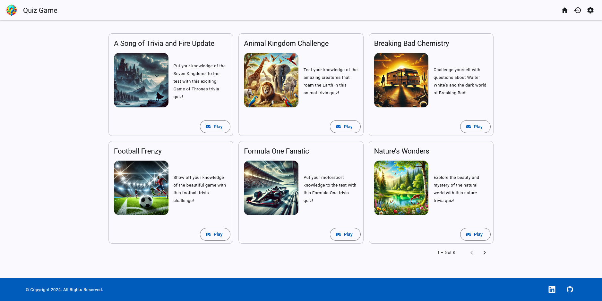
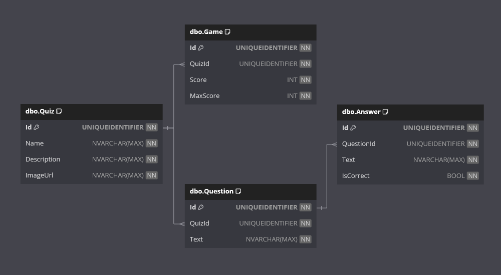

# Quiz Game

Welcome to the **Quiz Game** App!

This is .NET and Angular project designed to demonstrate a complete fullstack application with complex data relationships.

It allows users to play trivia based quiz games and record their scores. They can create, update and delete quizzes, and also visualise their previous games scores.

The web front end is delivered by Angular and utilise Angular Material components.
The API back end is delivered by .NET and provides the endpoints to manage the database records.

## Requirements

This application fulfills the following [The C# Academy - Quiz Game](https://thecsharpacademy.com/project/34/quiz-game) project requirements:

- [x] This is an application where you will create and play quiz games.
- [x] You should create two projects: A .NET WebApi and an Angular app.
- [x] You can choose whatever database solution you want: Sqlite, SQL server or whatever you're comfortable with.
- [x] You can choose only use Entity Framework, no other ORM is allowed.
- [x] Your database should have three tables: Question, Quiz, Game.
- [x] A question needs to have a Quiz associated with it, hence a foreign key is needed.
- [x] A game needs to have a Quiz associated with it, hence a foreign key is needed.
- [x] If a quiz is deleted, all questions and games associated with it need to be deleted.
- [x] You need to use pagination, which means you can't show any lists or tables longer than the height of the screen.
- [x] You need to use Angular Material.

## Features

- **Angular**:
  - The web front end has been built with Angular v18.
- **Angular Material**:
  - The web components are provided by Angular Material.
- **Dialogs**:
  - Add, edit and delete forms are provided as dialogs as to not navigate away from the main page. Add and edit are combined into an upsert form.
- **Form Validation**:
  - Form validation will ensure a form is valid before submission, and validation errors will be displayed on the associated control.
- **Snack Bars**:
  - Snack bars are used to display success, error, and warning messages after database actions.
- **.NET API**:
  - The front end interfaces with the back end through an API layer.
- **Versioned API**:
  - The API is a versioned API allowing for future feature expansion.
- **Paginated API Response**:
  - The Games route includes a paginated endpoint, so that only the required display data is retrieved.
- **Cached API Response**:
  - The Quiz route includes memory caching, so that any requests are cached for a period of time and reduces the amount of database trips.
- **Entity Framework Core**:
  - Entity Framework Core is used as the ORM.
- **SQL Server**:
  - SQL Server is used as the data provider.
- **Responsive Web Design**:
  - A user-friendly web interface designed to work on various devices.

## Technologies

- .NET
- Angular
- Angular Material
- HTML
- CSS
- TypeScript
- Entity Framework Core
- SQL Server

## Getting Started

**IMPORTANT NOTE**:

The `InitialCreate` database migration has been created.

On start-up of the **API** application, any required database creation/migrations will be performed programmatically.

### Prerequisites

- .NET 8 SDK.
- Angular v18.
- Angular Material v18.
- A code editor like Visual Studio or Visual Studio Code.
- SQL Server.
- SQL Server Management Studio (optional).
- Node.js.
- NPM.

### Installation

1. Clone the repository:

   - `git clone https://github.com/chrisjamiecarter/quiz-game.git`

2. Navigate to the API project directory:

   - `cd src\QuizGame.Api`

3. Configure the application:

   - Update the connection string in `appsettings.json`.
   - You can also use .NET user secrets. Just add a value for the following keys:
     - `<database-server>`
     - `<database-user>`
     - `<database-user-password>`

4. Build the application using the .NET CLI:

   - `dotnet build`

5. Navigate to the Web project directory:

   - `cd src\QuizGame.Web`

6. Install dependencies:
   - `npm install`

### Running the Application

1. You can run both applications from Visual Studio, using the **Multiple Startup Projects** option and selecting the \*.Api and \*.web projects.

OR

1. Run the API application using the .NET CLI in the API project directory:

   - `cd src\QuizGame.Api`
   - `dotnet run`

2. Start the development server in the Web project directory:
   - `cd src\QuizGame.web`
   - `npm start`

## Usage

YouTube Video Demonstration:

## How It Works

- **Web Project**: This project was generated with [Angular CLI](https://github.com/angular/angular-cli) version 18.2.9.
- **Web Design**: This project uses components provided by [Angular Material](https://material.angular.io/) version 18.2.9.
- **API Project**: HTTP requests are used to interface the web and api projects.
- **Quiz**: A Quiz can be created/updated by supplying the Name and a set of questions and answers. Description and Image URL are optional, each question must have one correct answer only. A Quiz can be deleted, and this will delete all associated questions, answers and games for that Quiz.
- **Game**: A Game can be played by choosing a Quiz and answering the questions. A Game cannot be edited or deleted by itself.
- **Paginated API Response**: Supply the page index, page size and other query parameters to return a paged games response.
- **Cached API Response**: IMemoryCache is utilised to add data to the cache for a duration, any create/delete/update requests will invalid the cache.
- **Data Storage**: A new SQL Server database is created and the required schema is set up at run-time, or an existing database is used if previously created.
- **Data Access**: Interaction with the database is via Entity Framework Core.
- **Mock Data**: This project will automatically generate a selection of quizzes and games using the _Bogus_ package.

## API Endpoints

The Quiz Game API provides a set of versioned endpoints for managing quizzes, questions, answers, and games.

It uses **ASP.Versioning** to support API versioning, the current version is `v1` and the version is specified in the URL path, e.g., `/api/v1`.

It uses OpenAPI for documentation, use the `/swagger` endpoint to view the API documentation in your browser. All responses follow RESTful standards with appropriate status codes.

Some endpoints require request validation. Example validation objects:

- `AnswerCreateRequest`, `AnswerUpdateRequest`
- `GameCreateRequest`
- `QuestionCreateRequest`, `QuestionUpdateRequest`
- `QuizCreateRequest`, `QuizUpdateRequest`

### Endpoints

#### **Answers**

`/api/v1/quizgame/answers`

| Method | Endpoint | Description                |
| ------ | -------- | -------------------------- |
| GET    | `/`      | Get all answers.           |
| GET    | `/{id}`  | Get an answer by ID.       |
| POST   | `/`      | Create a new answer.       |
| PUT    | `/{id}`  | Update an existing answer. |
| DELETE | `/{id}`  | Delete an existing answer. |

#### **Games**

`/api/v1/quizgame/games`

| Method | Endpoint | Description                    |
| ------ | -------- | ------------------------------ |
| GET    | `/`      | Get all games.                 |
| GET    | `/page`  | Get a paginated list of games. |
| GET    | `/{id}`  | Get a game by ID.              |
| POST   | `/`      | Create a new game.             |

#### **Questions**

`/api/v1/quizgame/questions`

| Method | Endpoint        | Description                              |
| ------ | --------------- | ---------------------------------------- |
| GET    | `/`             | Get all questions.                       |
| GET    | `/{id}`         | Get a question by ID.                    |
| GET    | `/{id}/answers` | Get all answers for a specific question. |
| POST   | `/`             | Create a new question.                   |
| PUT    | `/{id}`         | Update an existing question.             |
| DELETE | `/{id}`         | Delete an existing question.             |

#### **Quizzes**

`/api/v1/quizgame/quizzes`

| Method | Endpoint          | Description                               |
| ------ | ----------------- | ----------------------------------------- |
| GET    | `/`               | Get all quizzes.                          |
| GET    | `/{id}`           | Get a quiz by ID.                         |
| GET    | `/{id}/games`     | Get all games for a specific quiz.        |
| GET    | `/{id}/questions` | Get all questions for a specific quiz.    |
| POST   | `/`               | Create a new quiz.                        |
| PUT    | `/{id}`           | Update an existing quiz.                  |
| DELETE | `/{id}`           | Delete an existing quiz.                  |
| DELETE | `/{id}/questions` | Delete all questions for a specific quiz. |

## Database

---

**_Happy Quiz Gaming!_**
